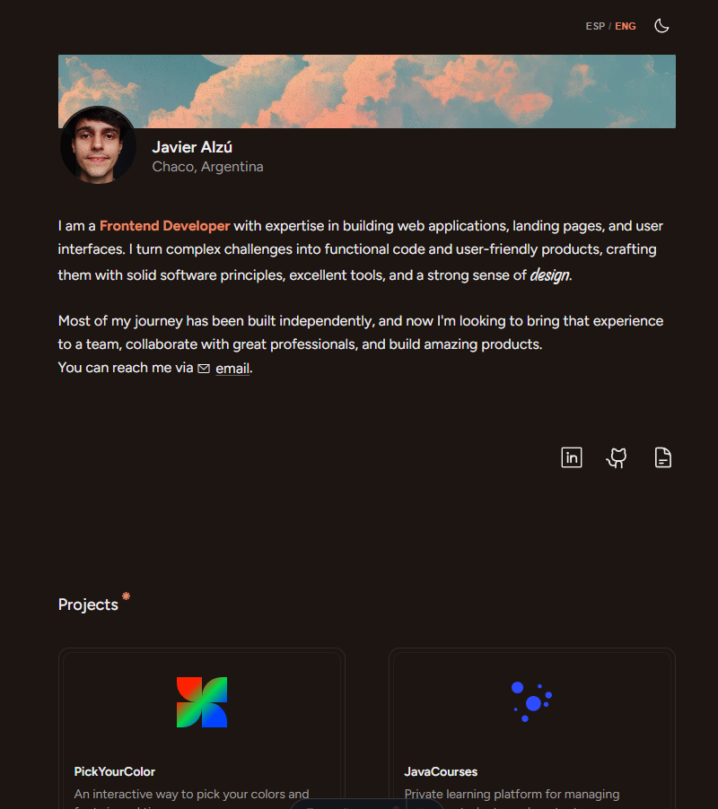

# Javier Alzú — Portfolio



## Stack

- **Framework:** Astro 7 (`astro@^7.2.2`) — static-first, islands
- **Animations:** GSAP 3
- **Language:** TypeScript (strict)
- **Styling:** Vanilla CSS + design tokens (`src/styles/tokens.css` / `global.css`), OKLCH colors, custom fonts (Figtree, Story Script)
- **Runtime:** Node `>=22.12.0` · Package manager: **Bun** (`bun.lock`)

## Getting Started

Requires [Bun](https://bun.sh) and Node >=22.12.0.

```sh
# 1. Clone
git clone https://github.com/jaalzu/portfolio-v2.git
cd portfolio-v2

# 2. Install (Bun)
bun install

# 3. Dev server
bun run dev
# → http://localhost:4321

# Background mode (per AGENTS.md)
bunx astro dev --background
bunx astro dev status
bunx astro dev logs
bunx astro dev stop
```

> You have both `bun.lock` and `package-lock.json` in the repo. If Bun is your source of truth, you can delete `package-lock.json` and commit only `bun.lock`.

## Commands

All from the project root:

| Command                | Action                                           |
| :--------------------- | :----------------------------------------------- |
| `bun install`          | Install dependencies                             |
| `bun run dev`          | Dev server at `localhost:4321`                   |
| `bun run build`        | Production build → `./dist/`                     |
| `bun run preview`      | Preview build locally                            |
| `bunx astro ...`       | Run Astro CLI (`astro add`, `astro check`, etc.) |
| `bunx astro -- --help` | Astro CLI help                                   |

With npm (if you prefer) the equivalents are `npm install`, `npm run dev`, etc., but **Bun is recommended** for this repo.

## OG Image

<meta property="image" content="/og.png" />
<meta property="og:image" content="/og.png" />
```

## Build & Deploy

```sh
bun run build      # → dist/
bun run preview    # verify locally
```

Works on any static host (Vercel, Netlify, Cloudflare Pages). If you set `site` in `astro.config.mjs`, Astro will generate correct canonical/OG URLs.

## Docs

- [Astro routing](https://docs.astro.build/en/guides/routing/)
- [Astro components](https://docs.astro.build/en/basics/astro-components/)
- [Astro + framework components](https://docs.astro.build/en/guides/framework-components/)
- [Content collections](https://docs.astro.build/en/guides/content-collections/)
- [Styling / Tailwind](https://docs.astro.build/en/guides/styling/)
